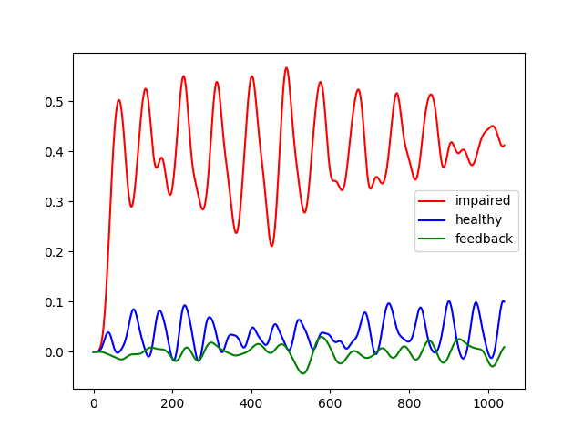

# Gait Feedback and Correction Generation Using Multivariate Signal Learning

## Description
- Pytorh GPU implementation of the Project `Gait Feedback Discovery and Correction Using Multivariate Time-Series Learning`
- Basic Neural Network Architecture for Long-Sequence Multivariate Time-Series Learning   

## Abstract
Gait analysis is the systematic study of human lo-
comotion using external visual and sensory observa-
tions. Data extraction from such observations en-
ables the quantitative assessment of human motion
skills that can lead to feedback discovery and physical
ability evaluation. Current research methods in hu-
man gait analysis cover a substantial portion on gait-
phase identification, locomotion recognition and gait
trajectory prediction. Although recognizing and pre-
dicting human phase-gait cycles is important for un-
derstanding and analyzing physical motor ability, it
is insufficient to provide objective gait rate feedback
and motor function recovery. In this work we intro-
duce and implement the Feedback Recovery Network
(FDRNet). FDRNet is a novel deep neural network ar-
chitecture able to provide objective personalized quan-
titative gait feedback discovery and correction on mul-
tivariate time-series data. We train FDRNet using an
online available dataset containing 1020 multivariate
gait signals from 230 subjects undergoing a fixed pro-
tocol: standing still, walking 10 m, turning around,
walking back and stopping. The measured popula-
tion is composed of healthy subjects as well as pa-
tients with neurological or orthopedic disorders. The
FDRNet holds promise for automation in personalized
rehabilitation and considers the potential of creating
new technology in the area of physical ability perfor-
mance assessments.

## Code
- All source code is in `source`.
- Train using the `main.py` file.
- Get model predictions using the `predict.py` file.

## Documentation
- Code is the documentation of itself
- Project report can be found at `Project.pdf` file

## Usage
- Use `python3 main.py` to train your feedback discovery network.
- A summary of the pipeline is given in `report.pdf`.

## Demonstration
The pipeline is demonstrated below.

#- Training Curves.
#
#| Losses | Accuracies |
#| --- | --- |
#|  |  |
#
#- Classification Confusion Matrix.
#
#| Absolute Values | Percentages |
#| --- | --- |
#|  |  |

- Feedback Discovery on a sample of 16-channel time series per 1042 time-step signal.

| Left Foot Vertical Acceleration [LAV]
| --- |
| 

## Contact
- apost035@umn.edu, trs.apostolou@gmail.com

